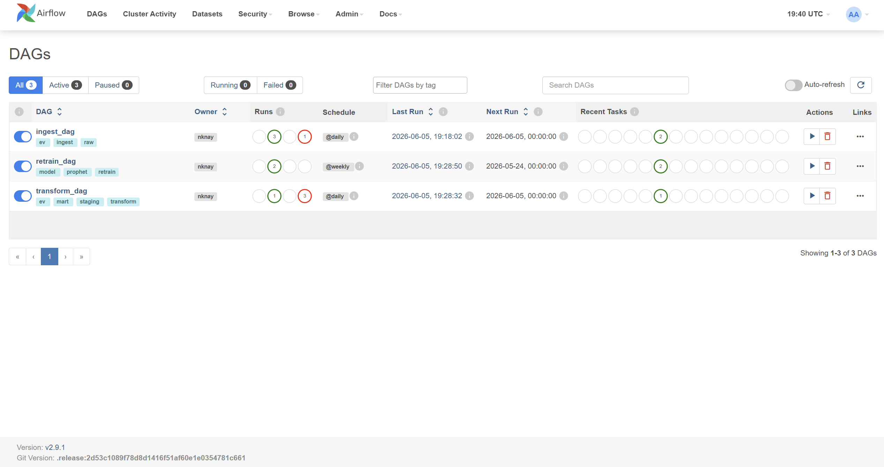
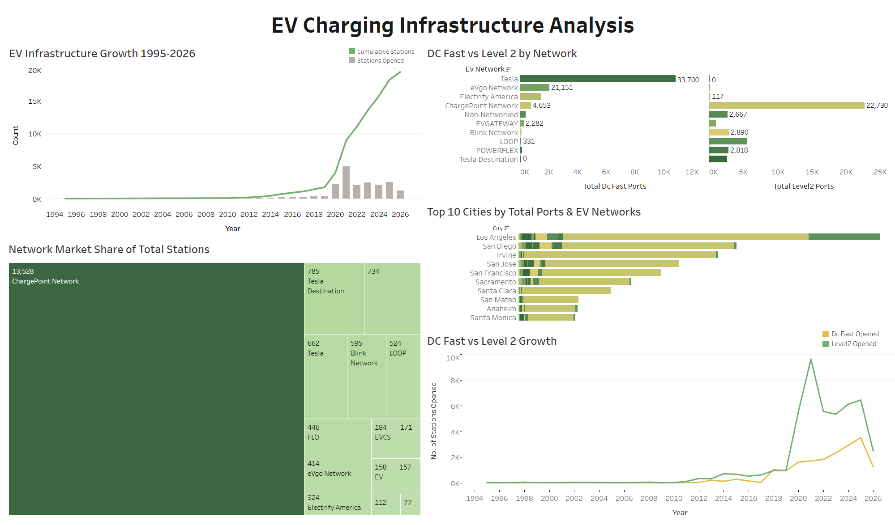

# California EV Charging Infrastructure Analytics & Capacity Forecasting Pipeline

## Business Problem
California's EV charging network is growing rapidly, but infrastructure gaps in DC Fast charging
and uneven network distribution create grid planning challenges. This pipeline ingests, transforms,
and analyzes 19,432 real EV charging stations across California to surface actionable insights on
infrastructure growth, network market share, and capacity demand forecasting.



## Tech Stack
| Layer | Tool |
|-------|------|
| Ingestion | Python, REST API (NLR/NREL) |
| Orchestration | Apache Airflow 2.9.1 |
| Database | PostgreSQL 15 (Docker) |
| Transform | Python, SQL (3-layer warehouse) |
| Modeling | Facebook Prophet |
| Visualization | Tableau Public |
| Version Control | Git + GitHub |
| Environment | Docker, WSL2, Ubuntu |

## Pipeline Structure
| Schema | Table | Description |
|--------|-------|-------------|
| raw | ev_stations | 19,432 raw station records from NLR API |
| staging | stg_stations | Cleaned, type-cast EV-only records |
| mart | fct_hourly_demand | 3,057 city-network aggregations |
| mart | station_growth | Monthly station opening time series (1995-2026) |
| mart | model_metrics | Prophet model MAE/RMSE per city-network |
| raw | dq_log | Automated data quality check results |

## Key Insights
- ChargePoint dominates California by station count (13,528 stations), the largest single network
- A bifurcated charging market: Tesla's network is ~100% DC Fast (33,700 ports, 0 Level 2), while
  ChargePoint is overwhelmingly Level 2 (22,730 vs. 4,653 DC Fast) — two very different charging
  experiences depending on network
- EV infrastructure grew exponentially post-2019, with 5,000+ new stations opened in 2021 alone
- Los Angeles has the highest port capacity (8,000+ ports) but also the highest forecast error,
  suggesting large/dense markets need segmented rather than citywide forecasting models
- Prophet models achieve MAE as low as 22.35 ports (Menlo Park) vs 289 (Los Angeles)

## Airflow DAGs
| DAG | Schedule | Tasks |
|-----|----------|-------|
| ingest_dag | Daily | fetch_ev_stations → load_to_postgres |
| transform_dag | Daily | run_transforms (staging + mart) |
| retrain_dag | Weekly | train_models → evaluate_models |

## How to Run Locally
1. Clone the repo
```bash
   git clone https://github.com/Nayan-N-Kadhre/ev-demand-forecasting.git
   cd ev-demand-forecasting
```
2. Create a `.env` file with your own credentials
```bash
   cp .env.example .env
   # then edit .env with your NREL_API_KEY and DB_PASSWORD
```
3. Start Postgres and Airflow
```bash
   docker-compose up -d
```
4. Create virtual environment
```bash
   python3.12 -m venv venv
   source venv/bin/activate
   pip install -r requirements.txt
```
5. Run pipeline manually
```bash
   python src/extract/fetch_sessions.py
   python src/load/load_raw.py
   python src/transform/run_transforms.py
   python src/model/train.py
   python src/model/evaluate.py
   python src/model/predict.py
```

## Results
- 19,432 EV stations ingested and warehoused
- 3,057 city-network combinations analyzed
- 10 Prophet forecasting models trained and evaluated
- Best model MAE: 22.35 (Menlo Park - ChargePoint)
- 6-panel Tableau dashboard published to Tableau Public
- Credentials managed via environment variables (no secrets committed to version control)

## Dashboard


[View live on Tableau Public](https://public.tableau.com/views/EVChargingInfrastructureAnalytics/Dashboard1?:language=en-US&:sid=&:redirect=auth&:display_count=n&:origin=viz_share_link)
